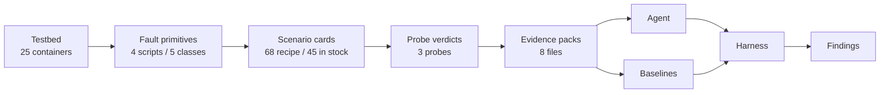

# rca-agent-bench

**A benchmark for root-cause-analysis agents, where the injected fault is the ground truth.**

<!-- GEN:badges -->    <!-- /GEN -->

| <!-- GEN:hero_top1 -->75.0%<!-- /GEN --> | <!-- GEN:hero_gain -->+18.8 pts<!-- /GEN --> | <!-- GEN:hero_cost -->$0.069<!-- /GEN --> / <!-- GEN:hero_p95 -->63 s<!-- /GEN --> |
| :--- | :--- | :--- |
| holdout top-1, agent on <!-- GEN:holdout_set_size -->16<!-- /GEN --> unseen cards | over the single-shot LLM on the same cards | per diagnosis, wall clock |

A script injects one fault into a running OpenTelemetry Demo and reverts it. The
window is frozen into a read-only evidence pack, and the pair the script applied
becomes the answer key. Every arm reads the same pack offline and is graded by the
same function.

---

## Results

<!-- GEN:figure_arms --><!-- /GEN -->

Three arms on cards none of them was tuned on: rules over the pack, one model turn
with no tools, and a tool-calling agent. One card is worth
<!-- GEN:holdout_card_points -->6.25<!-- /GEN --> points here, so read the gaps as
an ordering rather than as a measurement.

The rules arm is where tuning can be priced. Restricted to the classes the holdout
contains, it scores <!-- GEN:rules_overfit_seen -->12/18<!-- /GEN --> on the cards
it was tuned on and <!-- GEN:rules_overfit_held -->8/16<!-- /GEN --> on cards it has
never seen, a change of <!-- GEN:rules_overfit_delta -->-16.7<!-- /GEN --> points.
Almost all of it is one class: blackhole goes
<!-- GEN:rules_overfit_blackhole -->3/6 to 0/6<!-- /GEN -->.

---

## One diagnosis, start to finish

Card `<!-- GEN:walkthrough_card -->blackhole-shipping-01<!-- /GEN -->`, from the
holdout set: <!-- GEN:walkthrough_steps -->7<!-- /GEN --> steps,
<!-- GEN:walkthrough_tool_calls -->15<!-- /GEN --> tool calls,
<!-- GEN:walkthrough_wall -->63 s<!-- /GEN -->,
<!-- GEN:walkthrough_cost -->$0.129<!-- /GEN -->. The alerts name `frontend` and
`checkout` — the services that observed the problem, not the one that caused it.

| # | tools | what came back |
| ---: | --- | --- |
| 1 | `topology`, `traces_query` | The graph puts `shipping` under both alerting services. Its spans in the window: none. |
| 2 | `traces_query` ×2, `logs_search` | `checkout -> shipping` is silent and so is `shipping -> quote`. But `shipping` is still writing logs. |
| 3 | `logs_search`, `traces_query` | `quote` below it is healthy and answering, so `shipping` is not blocked from underneath. |
| 4 | `traces_query`, `metrics_query` | Widening the window finds calls before and after the fault, none inside. Memory is flat, so no leak. |
| 5 | `traces_query` ×2 | `checkout`'s order spans sit at its client timeout; its other dependencies answer in milliseconds. |
| 6 | `config_diff` | Empty. No flag and no environment change, so not a misconfiguration. |
| 7 | `submit` | Alive in its logs, unreachable to its callers, no errors anywhere: a blackhole, not a crash. |

**Submitted <!-- GEN:walkthrough_agent -->shipping / blackhole<!-- /GEN -->, truth
<!-- GEN:walkthrough_truth -->shipping / blackhole<!-- /GEN -->.** On the same card
the rules arm answered
<!-- GEN:walkthrough_rules -->payment / crash<!-- /GEN --> and the single-shot arm
<!-- GEN:walkthrough_single_shot -->checkout / latency<!-- /GEN -->.

The agent never sees the card id, the primitive that was run, or the ground truth.
Its input is a trigger sentence and the symptom window; a leak check asserts that
before the first token of every card.

---

## How it works

<!-- GEN:flowchart -->

<!-- /GEN -->

- **Testbed** — the OpenTelemetry Demo on one host under Docker Compose, with
  Prometheus, Jaeger and OpenSearch as the three signal backends.
- **Fault primitives** — <!-- GEN:primitive_scripts -->4<!-- /GEN --> shell scripts
  behind one `apply` / `revert` / `probe` interface, covering
  <!-- GEN:fault_classes -->5<!-- /GEN --> fault classes.
- **Scenario cards** — <!-- GEN:recipe_cards -->68<!-- /GEN --> recipe rows
  generated into yaml; a card enters the set only after a clean run.
- **Probe verdicts** — the runner decides from the three backends that the
  injection took, the symptom appeared and the service recovered, plus a residue
  check. The arms never see any of it.
- **Evidence packs** — the window frozen to disk,
  <!-- GEN:evidence_files -->8<!-- /GEN --> files per card, of which
  <!-- GEN:evidence_hashed -->5<!-- /GEN --> carry a sha256 in the manifest.
- **Harness** — one grader for every arm: top-1, service-only, steps, cost per card
  and p95 wall clock.

---

<details>
<summary><b>Testbed &amp; fault injection</b></summary>

<br>

The demo runs <!-- GEN:containers -->25<!-- /GEN --> containers, of which
<!-- GEN:injectable_targets -->16<!-- /GEN --> are injection targets. The rest are
the observability backends, the collector, the load generator and the control
plane, which cannot be faulted without cutting off the evidence.

<!-- GEN:primitive_scripts -->4<!-- /GEN --> primitive scripts cover
<!-- GEN:fault_classes -->5<!-- /GEN --> classes: container kill, inbound packet
drop inside the target's network namespace, outbound delay filtered by service
port, and a flag write that serves both misconfiguration and memory-leak cards.
Injection is filtered down to the target's own traffic rather than cutting a
container off the network.

Rate and latency comparisons use a
<!-- GEN:baseline_window_s -->300<!-- /GEN --> second baseline window before
injection. <!-- GEN:recover_window_cards -->34<!-- /GEN --> cards carry a longer
recovery window, solved offline from the target's measured call rate so the window
can hold enough calls to decide recovery at all. Targets whose callers have no SDK
are judged by a separate arm that reads the caller's view.

The detector that turns a pack into alerts has
<!-- GEN:alert_rules -->7<!-- /GEN --> rules, including a
<!-- GEN:p95_floor_ms -->100<!-- /GEN --> ms absolute floor on latency jumps, so a
ratio over a tiny baseline cannot fire on its own.

</details>

<details>
<summary><b>Agent &amp; guards</b></summary>

<br>

A hand-written function-calling loop against the Anthropic SDK: no agent framework,
the loop is a `while` over `messages.create`. The model is
`<!-- GEN:agent_model -->claude-sonnet-5<!-- /GEN -->`.

<!-- GEN:agent_tools -->6<!-- /GEN --> read-only tools over the pack — log search,
metric query, trace query, config diff, topology, alerts — plus `submit` as a tool,
so the answer space is enforced by a JSON schema rather than parsed out of prose.

<!-- GEN:agent_guards -->5<!-- /GEN --> guards, each recorded per run: argument
validation, in-tool retry, a format nudge when a turn calls no tool, a step breaker
at <!-- GEN:max_steps -->20<!-- /GEN --> steps, and a cost breaker at
$<!-- GEN:cost_cap_usd -->0.20<!-- /GEN --> per card.

The leak check runs before the first API call of every card. It asserts that the
system prompt and tool schemas are card-independent constants and that the user
turn is a projection of the task view, and raises instead of continuing. It is one
of the CI gates.

The prompt was iterated once on a <!-- GEN:devset_size -->19<!-- /GEN -->-card dev
set, from <!-- GEN:devset_before -->52.6%<!-- /GEN --> to
<!-- GEN:devset_after -->57.9%<!-- /GEN --> top-1, then frozen before any holdout
run. Service-only accuracy moved the other way in the same edit.

</details>

<details>
<summary><b>Evaluation harness &amp; baselines</b></summary>

<br>

**Rules, no model.** Deterministic scoring over the same pack: walks the topology
out from the alerting services, separates starved callers from broken callees, and
takes every threshold from constants the harness already used. Zero API calls.

**Single-shot LLM.** One model turn over a fixed digest of the same pack, no tools,
same model and same answer space as the agent. The only variable between it and the
agent is the loop.

All <!-- GEN:eval_set_size -->43<!-- /GEN --> in-stock cards at the time the set was
frozen:

| arm | top-1 | service-only | steps | cost/card | p95 |
| --- | ---: | ---: | ---: | ---: | ---: |
| rules, no model | <!-- GEN:all43.rules.top1 -->62.8% (27/43)<!-- /GEN --> | <!-- GEN:all43.rules.service -->72.1% (31/43)<!-- /GEN --> | <!-- GEN:all43.rules.steps -->1.00<!-- /GEN --> | <!-- GEN:all43.rules.cost -->$0.0000<!-- /GEN --> | <!-- GEN:all43.rules.p95 -->0.4s<!-- /GEN --> |
| single-shot LLM | <!-- GEN:all43.single_shot.top1 -->46.5% (20/43)<!-- /GEN --> | <!-- GEN:all43.single_shot.service -->72.1% (31/43)<!-- /GEN --> | <!-- GEN:all43.single_shot.steps -->1.00<!-- /GEN --> | <!-- GEN:all43.single_shot.cost -->$0.0240<!-- /GEN --> | <!-- GEN:all43.single_shot.p95 -->38.9s<!-- /GEN --> |
| agent | <!-- GEN:all43.agent.top1 -->65.1% (28/43)<!-- /GEN --> | <!-- GEN:all43.agent.service -->83.7% (36/43)<!-- /GEN --> | <!-- GEN:all43.agent.steps -->5.40<!-- /GEN --> | <!-- GEN:all43.agent.cost -->$0.0726<!-- /GEN --> | <!-- GEN:all43.agent.p95 -->63.8s<!-- /GEN --> |

<!-- haiku arms: added by cross-model step -->

The holdout table above is the one to read: this set includes the
<!-- GEN:devset_size -->19<!-- /GEN --> dev cards the prompt was written against and
the 27 cards the rules arm was tuned on, so no arm here is clean. One card is worth
<!-- GEN:eval_card_points -->2.33<!-- /GEN --> points.

<!-- GEN:eval_set_size -->43<!-- /GEN --> cards are evaluated while
<!-- GEN:instock_cards -->45<!-- /GEN --> are in stock: the card list was frozen
before the last batch landed, and a frozen list is what keeps two runs comparable.
Steps and p95 are 1 and sub-second for the rules arm by construction — it cannot
investigate. p95 is wall clock and includes local reads of the pack.

</details>

<details>
<summary><b>Engineering &amp; reliability</b></summary>

<br>

CI is <!-- GEN:ci_gates -->3<!-- /GEN --> offline gates on every push: pytest
including the leak assertions, a check that regenerating every card from the recipe
changes nothing, and the detector staying silent on two fault-free windows. No gate
touches the VM or the API.

A `None`-versus-zero audit walked <!-- GEN:audit_paths -->27<!-- /GEN --> verdict
paths and fixed <!-- GEN:audit_fixes -->7<!-- /GEN --> places that read a missing
measurement as a zero, then replayed the
<!-- GEN:audit_replay_cards -->41<!-- /GEN --> cards in stock at that date to
confirm the defect had never passed a card.

Cards come from an unattended batch runner: a global serial lock so only one fault
is ever live, `nohup` wrapping, and abort on consecutive failures rather than on the
first one. <!-- GEN:batch_count -->7<!-- /GEN --> recorded batches account for
<!-- GEN:batch_hours -->8.9<!-- /GEN --> hours of machine time.

Every model call is priced per card:
<!-- GEN:api_spend -->$9.07<!-- /GEN --> over
<!-- GEN:api_runs -->237<!-- /GEN --> metered single-card runs. Repository scale:
<!-- GEN:commits -->~68<!-- /GEN --> commits,
<!-- GEN:code_loc -->~8.3k<!-- /GEN --> lines of Python and shell,
<!-- GEN:docs_loc -->~6.8k<!-- /GEN --> lines of design docs.

</details>

---

## Findings

Eight items, each one paid for by a batch or a wrong verdict —
[`docs/findings.md`](docs/findings.md) has the analysis,
[`docs/open_items.md`](docs/open_items.md) the running list.

- **F-1** · A 10% failure rate is invisible to a 120-second window — the card was
  taken out of the set rather than kept as a hard one.
- **F-2** · Recovery windows sized in seconds fail on low-traffic targets: two cards
  failed on sample size, not on recovery.
- **F-3** · The latency verdict demanded that errors stay flat, which an 800 ms
  delay does not do; the conjunct was the bug, not the card.
- **F-4** · A client that reconnects after the fault is reverted can miss the
  recovery window entirely.
- **F-5** · A special case for long-lived connections was written as the general
  rule, and two cards were graded as the wrong class.
- **F-6** · One service's gRPC egress resolves its peer to a container IP, which
  leaves four edges permanently empty in the probe.
- **F-7** · Rules that look like 12/18 on cards they were tuned on fall to 8/16 on
  unseen ones — overfitting measured, not assumed.
- **F-8** · Breaking a connection can remove the instrumentation that proves it came
  back, which takes cards out of the set until the target restarts.

Four agent failure modes, in `docs/findings.md` §1: crash and blackhole collapse
into the same shape at harvest time; there is no procedure for memory leaks; on a
low-traffic target the caller takes the blame; and an edge that was never enumerated
is treated as an edge already ruled out.

---

## Limitations

- The verdicts are audited, not independently validated: every path where a verdict
  could read a missing measurement as a zero has been checked, but no labelled
  control set says the verdicts themselves are right.
- The holdout set contains no misconfiguration and no memory-leak cards, the two
  classes the rules arm is best at, so the overfitting result covers blackhole,
  crash and latency only.
- There is no human baseline anywhere in this repository.
- Every accuracy number in the tables above comes from one model family; the
  cross-configuration arms are not in them yet.
- Tier coverage is partial: the in-stock set is
  <!-- GEN:instock_by_class -->blackhole 12 / crash 12 / latency 12 / mem_leak 2 / misconfig 7<!-- /GEN -->,
  so the harder latency tier and most misconfiguration variants are thin or absent.
- <!-- GEN:valkey_blocked -->2<!-- /GEN --> cards against the cache target cannot be
  run at all: breaking its connection removes the instrumentation the verdict needs
  (open item O-P2-23).

---

## Reproduce

```bash
bash scripts/maintenance/wakeup.sh                                            # start the testbed, gate on health
python scripts/runner/run_batch.py --scenarios scenarios/crash-cart-01.yaml   # inject one card, probe, pack evidence
python scripts/harness/run_eval.py --cards crash-cart-01                      # run the agent on that pack and grade it
```

Every number on this page is generated: `python scripts/tools/readme_check.py
--check` compares it against the repository and `--write` refreshes it, figures
included.

Docs: [recipe](docs/recipe.md) · [fault schema](docs/fault_schema.md) ·
[fingerprints](docs/fingerprints.md) · [decisions](docs/decisions.md) ·
[open items](docs/open_items.md) · [evidence audit](docs/evidence_audit.md) ·
[probe audit](docs/probe_audit.md)

<details>
<summary><b>Repository layout</b></summary>

<br>

```
scripts/    primitives, batch runner, probes, evidence packer, detector, agent, baselines, harness
scenarios/  one yaml per card: target, primitive, params, cycle timing, ground truth, probe verdict
evidence/   one frozen pack per card, the only thing an arm may read
artifacts/  batch logs and per-run eval results with per-card cost
docs/       design docs, decisions, findings, audits, figures
tests/      offline tests: leak assertions, clean-window negative control
testbed/    compose overrides for the demo
tools/      fixture maintenance
```

</details>
