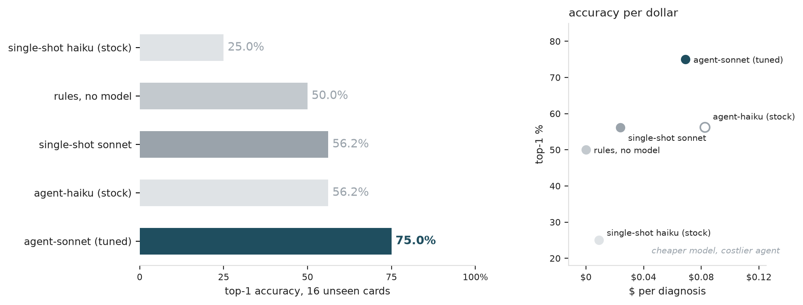
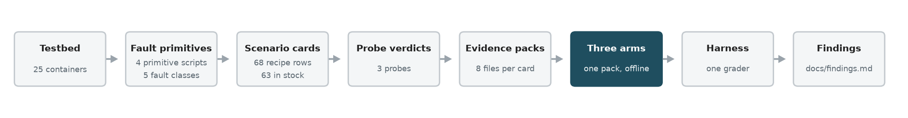

# rca-agent-bench

**A benchmark for root-cause-analysis agents, where the injected fault is the ground truth.**

<!-- GEN:badges -->

  

<!-- /GEN -->

<!-- GEN:hero_table -->

| **75.0%** | **+18.8 pts** | **$0.069 / 63 s** |
| :--- | :--- | :--- |
| holdout top-1, agent on 16 unseen cards | over the single-shot LLM on the same cards | per diagnosis, wall clock |

<!-- /GEN -->

A script injects one fault into a running OpenTelemetry Demo and reverts it. The window is frozen into a read-only evidence pack, the pair the script applied is the answer key, and every arm reads the same pack offline under the same grader.

## Results

<!-- GEN:figure_arms -->



<!-- /GEN -->

Five arms on 16 unseen cards: rules over the pack, one model turn with no tools, and an agent with 6 read-only tools, the last two run in a stock and a tuned configuration. One card is worth 6.25 points here, so the gaps are an ordering rather than a measurement.

## One diagnosis, start to finish

Card `blackhole-shipping-01` from the holdout set — 7 steps, 15 tool calls, 63 s, $0.129 — where the alerts name `frontend` and `checkout`, the services that observed the problem.

| # | tools | what came back |
| ---: | --- | --- |
| 1 | `topology`, `traces_query` | The graph puts `shipping` under both alerting services. Its spans in the window: none. |
| 2 | `traces_query` ×3, `logs_search` ×2 | Both of `shipping`'s edges are silent, `quote` below it is healthy, and `shipping` still writes logs. |
| 3 | `traces_query`, `metrics_query` | A wider window holds calls before and after the fault, none inside. Memory is flat, so no leak. |
| 4 | `traces_query`, `config_diff` | `checkout`'s order spans sit at its client timeout. The config diff is empty: nothing was reconfigured. |
| 5 | `submit` | Alive in its logs, unreachable to its callers, no errors anywhere — a blackhole, not a crash. |

**Submitted shipping / blackhole -- truth shipping / blackhole.**

The agent never sees the card id, the primitive that ran, or the ground truth: its input is a trigger sentence and the symptom window, and a leak check asserts that before the first API call.

## How it works

<!-- GEN:figure_pipeline -->



<!-- /GEN -->

- A card is one of 68 recipe rows generated into yaml: target, primitive, parameters, cycle timing, ground truth.
- The runner injects, reverts, then decides 3 probes and a residue check; a card enters the set only if all pass, and no arm sees the outcome.
- A pack is 8 files per card, 5 of them carry a sha256, and it is all an arm may read — evaluation never touches the live system.
- The harness grades every arm identically: top-1, service-only, steps, cost per card, p95 wall clock.

<details><summary><b>Testbed &amp; fault injection</b></summary>

- The demo runs 25 containers, of which 16 injection targets; the rest are observability backends, collector, load generator and control plane.
- 4 primitive scripts cover 5 fault classes behind one `apply` / `revert` / `probe` interface, filtered to the target's own traffic rather than cutting a container off the network.
- Verdicts compare against a 300-second baseline window before injection, and 34 cards carry a longer recovery window, solved offline from the target's measured call rate so the window can hold enough calls to decide recovery at all.
- Targets whose callers have no SDK are judged by a separate arm that reads the caller's view.
- 7 detector rules turn a pack into alerts, including a 100 ms floor so a ratio over a tiny baseline cannot fire on its own.

</details>

<details><summary><b>Agent &amp; guards</b></summary>

- A hand-written function-calling loop against the Anthropic SDK: no agent framework, the loop is a `while` over `messages.create`. The model is claude-sonnet-5.
- 6 read-only tools over the pack — log search, metric query, trace query, config diff, topology, alerts — plus `submit` as a tool, so a JSON schema enforces the answer space.
- 5 guards, each recorded per run: argument validation, in-tool retry, a nudge when a turn calls no tool, a breaker at 20 steps, a breaker at $0.20 per card.
- The leak check asserts the system prompt and tool schemas are card-independent constants and the user turn is a projection of the task view; it raises instead of continuing.
- The prompt was iterated once on a 19-card dev set, 52.6% to 57.9% top-1, then frozen before any holdout run. Service-only accuracy moved the other way in the same edit.

</details>

<details><summary><b>Evaluation harness &amp; baselines</b></summary>

- **Rules, no model.** A deterministic walk of the topology out from the alerting services, every threshold taken from constants the harness already used. Zero API calls.
- **Single-shot LLM.** One model turn over a fixed digest of the same pack, no tools, same model and answer space as the agent. The only variable between them is the loop.
- Tuning is measurable on the rules arm: class-aligned, it falls 16.7 points from 12/18 on cards it was tuned on to 8/16 on cards it has not seen, blackhole going 3/6 to 0/6.
- The stock arms run haiku 4.5 without thinking or effort, which that model rejects; the tuned arms run sonnet 5 with both. Prompt, tools, guards and breakers are identical across all five.

<!-- GEN:table_all43 -->

| arm | top-1 | service-only | steps | cost/card | p95 |
| --- | ---: | ---: | ---: | ---: | ---: |
| rules, no model | 62.8% (27/43) | 72.1% (31/43) | 1.00 | $0.0000 | 0.4s |
| single-shot sonnet | 46.5% (20/43) | 72.1% (31/43) | 1.00 | $0.0240 | 38.9s |
| single-shot haiku (stock) | 39.5% (17/43) | 69.8% (30/43) | 1.00 | $0.0091 | 9.8s |
| agent-haiku (stock) | 46.5% (20/43) | 60.5% (26/43) | 13.40 | $0.0768 | 93.0s |
| agent-sonnet (tuned) | 65.1% (28/43) | 83.7% (36/43) | 5.40 | $0.0726 | 63.8s |

<!-- /GEN -->

- No arm is clean here: the set holds the 19-card dev set and the 27 cards the rules arm was tuned on, and one card is worth 2.33 points.
- 43 cards are evaluated while 45 in stock — the list was frozen before the last batch landed, which is what keeps two runs comparable.
- Coverage is uneven: blackhole 12 / crash 12 / latency 12 / mem_leak 2 / misconfig 7, so the harder latency tier and most misconfiguration variants are thin or absent.
- 2 cache cards cannot be run at all: breaking that target's connection removes the instrumentation the verdict needs (O-P2-23 in [`docs/open_items.md`](docs/open_items.md)).

</details>

<details><summary><b>Engineering &amp; reliability</b></summary>

- CI is 3 offline gates on every push: pytest including the leak assertions, card generation being idempotent, the detector staying silent on two fault-free windows. No gate touches the VM or the API.
- A `None`-versus-zero audit walked 27 verdict paths, fixed 7 places that read a missing measurement as a zero, and replayed 41 cards to confirm none had ever passed on one.
- Cards come from an unattended batch runner: one global lock so a single fault is live at a time, `nohup` wrapping, and abort on consecutive failures rather than on the first one.
- 7 batches account for 8.9 hours of machine time; every model call is priced per card, $9 in metered API calls so far.
- Repository scale: ~70 commits and ~9k lines of Python and shell.

</details>

## Findings

- **Cost** · Swapping in the cheaper model did not buy a cheaper agent: 2.5× the steps ate the per-token discount, $3.30 vs $3.12 on 43 cards, 18.6 points lower.
- **F-7** · Rules that score 12/18 on cards they were tuned on fall to 8/16 on unseen ones — overfitting measured, not assumed.
- **F-8** · Breaking a connection removed the instrumentation that proves it came back, taking cards out of the set until the target was restarted.
- **F-1** · A 10% failure rate is invisible to a 120-second window; that card left the set instead of becoming a hard one.
- Five more, with the agent's five failure modes, in [`docs/findings.md`](docs/findings.md).

## Limitations

- The verdicts are audited, not independently validated: no labelled control set says the verdicts themselves are right.
- The holdout set has no misconfiguration and no memory-leak cards, the two classes the rules arm is best at.
- Two models from one family, and the cheaper one runs stock while the other is tuned — a cost-configuration comparison, not a model comparison.

## Reproduce

Start the testbed, produce one card, then run the agent on that card's pack and grade it:

```bash
bash scripts/maintenance/wakeup.sh
python scripts/runner/run_batch.py --scenarios scenarios/crash-cart-01.yaml
python scripts/harness/run_eval.py --cards crash-cart-01
```

Every number on this page is generated: `readme_check.py --check` compares it against the repository, `--write` refreshes the numbers and the figures.

Docs: [recipe](docs/recipe.md) · [fault schema](docs/fault_schema.md) · [fingerprints](docs/fingerprints.md) · [decisions](docs/decisions.md) · [open items](docs/open_items.md) · [evidence audit](docs/evidence_audit.md) · [probe audit](docs/probe_audit.md)

<details><summary><b>Repository layout</b></summary>

```
scripts/    primitives, batch runner, probes, evidence packer, detector, agent, baselines, harness
scenarios/  one yaml per card: target, primitive, params, cycle timing, ground truth, verdict
evidence/   one frozen pack per card, the only thing an arm may read
artifacts/  batch logs, per-run eval results with per-card cost
docs/       design docs, decisions, findings, audits, figures
tests/      offline tests; testbed/ compose overrides; tools/ fixture maintenance
```

</details>
